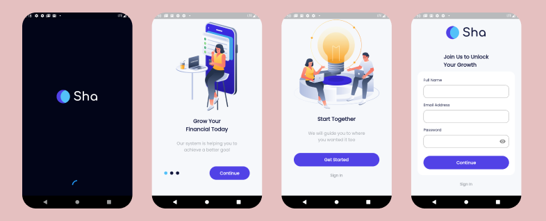
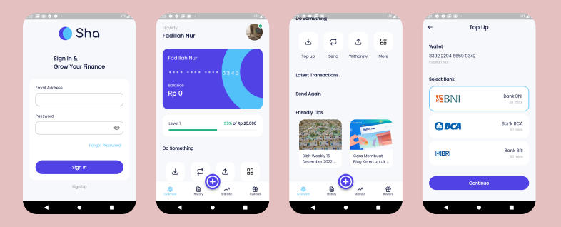
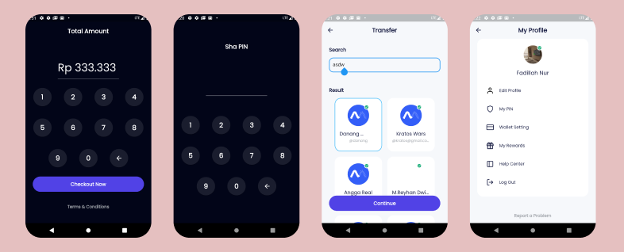
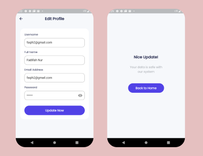

# Bank Sha (Flutter E-Wallet App) //API Consumed

This is a Flutter based E-Wallet App that utilizes the Bloc State Management pattern, Services and Models to manage state and data. It includes features such as authentication, top up system using the Midtrans demo, transferring funds to other users, and buying dummy data plans.

## Link Application
https://drive.google.com/file/d/14aD1r9KqVGRAF_Adj20WsOF-6wHyDs_F/view?usp=sharing

## Detail Application

## Dependencies
This app uses the following dependencies:

-  another_flushbar: ^1.12.29
-  carousel_slider: ^4.2.1
-  cupertino_icons: ^1.0.2
-  dartz: ^0.10.1
-  dio: ^5.0.2
-  equatable: ^2.0.5
-  flutter_bloc: ^8.1.2
-  flutter_secure_storage: ^8.0.0
-  google_fonts: ^3.0.1
-  image_picker: ^0.8.7
-  intl: ^0.18.0
-  url_launcher: ^6.1.10
-  flutter_launcher_icons: ^0.12.0

## Features

- Authentication
- Top Up System using Midtrans demo
- Transfer funds to other users
- Buy data Plans 
